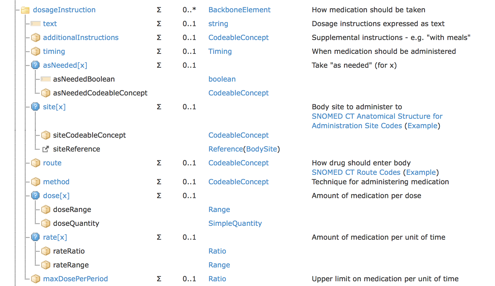
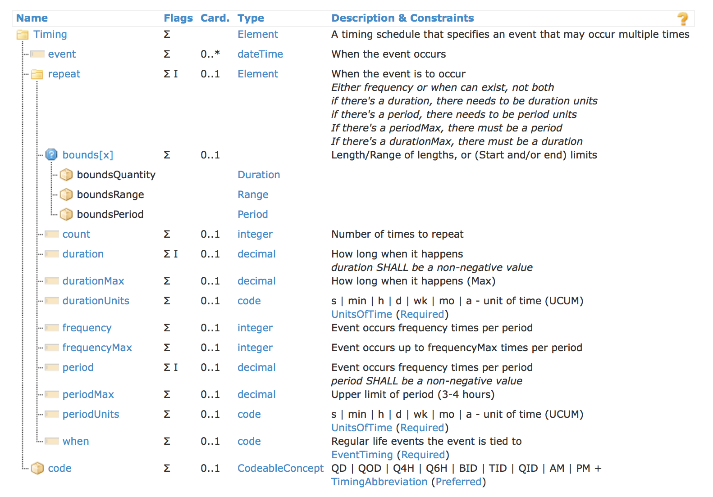

## DosageInstruction

Is a substructure of `MedicationOrder`.
Contains information about timing and dosageInstructions

>__Note__: `DosageInstruction` includes a text property which describes its content.
This property is ignored and descriptions are generated from the structured data.
This provides the possibility to localize the description (generate descriptions in different languages)

###### Structure

the generated suggestions are composed of three properties:

- timing
- dose

### Timing

https://www.hl7.org/fhir/datatypes.html#Timing

###### Structure

to generate timing-suggestions the following table is be used as a reference.

<dl>
<table class="grid">
 <tbody><tr><td><b>description</b></td> <td><b>duration</b></td> <td><b>durationUnits</b></td> <td><b>frequency</b></td> <td><b>frequencyMax</b></td> <td><b>period</b></td> <td><b>periodUnits</b></td> <td><b>periodMax</b></td> <td><b>when</b></td> <td><b>bounds[x]</b></td></tr>
 <tr><td>BID</td>                <td>                </td><td>                     </td><td>2</td>                <td>                    </td><td>1</td>             <td>d</td>                  <td>                 </td><td>            </td><td></td></tr>
 <tr><td>TID</td>                <td>                </td><td>                     </td><td>3</td>                <td>                    </td><td>1</td>             <td>d</td>                  <td>                 </td><td>            </td><td></td></tr>
 <tr><td>QID</td>                <td>                </td><td>                     </td><td>4</td>                <td>                    </td><td>1</td>             <td>d</td>                  <td>                 </td><td>            </td><td></td></tr>
 <tr><td>Q6H</td>                <td>                </td><td>                     </td><td>1</td>                <td>                    </td><td>6</td>             <td>h</td>                  <td>                 </td><td>            </td><td></td></tr>
 <tr><td>Every 8 hours</td>      <td>                </td><td>                     </td><td>1</td>                <td>                    </td><td>8</td>             <td>h</td>                  <td>                 </td><td>            </td><td></td></tr>
 <tr><td>Every 7 days</td>       <td>                </td><td>                     </td><td>1</td>                <td>                    </td><td>7</td>             <td>d</td>                  <td>                 </td><td>            </td><td></td></tr>
 <tr><td>3 times a day</td>      <td>                </td><td>                     </td><td>3</td>                <td>                    </td><td>1</td>             <td>d</td>                  <td>                 </td><td>            </td><td></td></tr>
 <tr><td>3-4 times a day</td>    <td>                </td><td>                     </td><td>3</td>                <td>4</td>                   <td>1</td>             <td>d</td>                  <td>                 </td><td>            </td><td></td></tr>
 <tr><td>Every 4-6 hours</td>    <td>                </td><td>                     </td><td>1</td>                <td>                    </td><td>4</td>             <td>h</td>                  <td>6</td>                <td>            </td><td></td></tr>
 <tr><td>Every 21 days for 1 hour</td> <td>1</td>         <td>hr</td>                   <td>1</td>                <td>                    </td><td>21</td>            <td>d</td>                  <td>                 </td><td>            </td><td></td></tr>
 <tr><td>Three times a week for ½ hour</td> <td>0.5</td>  <td>hr</td>                   <td>3</td>                <td>                    </td><td>1</td>             <td>wk</td>                 <td>                 </td><td>            </td><td></td></tr>
 <tr><td>With breakfast</td>     <td>                </td><td>                     </td><td>                 </td><td>                    </td><td>              </td><td>                   </td><td>                 </td><td>CM</td>          <td></td></tr>
 <tr><td>For 5 minutes, 10 minutes before meals</td> <td>5</td>     <td>min</td>        <td>                 </td><td>                    </td><td>10</td>            <td>min</td>                <td>                 </td><td>AC</td>          <td></td></tr>
 <tr><td>TID, for 14 days</td>   <td>                </td><td>                     </td><td>3</td>                <td>                    </td><td>1</td>             <td>d</td>                  <td>                 </td><td>            </td><td>Duration = 14 days</td></tr>
 <tr><td>BID, start on 7/1/2015 at 1:00 PM</td> <td> </td><td>                     </td><td>2</td>                <td>                    </td><td>1</td>             <td>d</td>                  <td>                 </td><td>            </td><td>Period, low = 2015-07-01T13:00:00</td></tr>
</tbody></table>
</dl>

### Dose

The amount of substance given at one administration event.

is either a single quantity or a range of quantities.

for more information on `Quantity` see:
https://www.hl7.org/fhir/datatypes.html#SimpleQuantity
