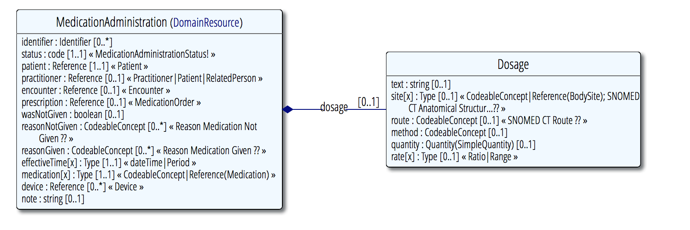

## MedicationAdministration
https://www.hl7.org/fhir/medicationadministration.html

Represents a medications administration or lack thereof.

The patient creates a `MedicationAdministration` when he/she takes/doesnt take a `Medication`

the `MedicationAdministration` must reference a `MedicationOrder`

### UML

##### Requirements

 requirement               | expression                                | required
---------------------------|-------------------------------------------|-------------
references patient         | `administration.patient != null`          | yes
references medication-order| `administration.prescription != null`     | yes
references medication      | `administration.medication != null`       | yes
effectiveTime set          | `patient.effectiveTime != null`           | yes

##### Example
[Nasivin-Administration.xml](examples/Nasivin-Administration.xml)
