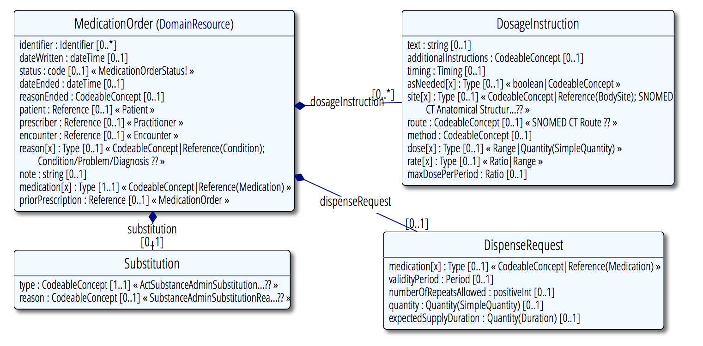

## MedicationOrder
https://www.hl7.org/fhir/medicationorder.html

The patient-resource has a central role in this app.
It contains basic information about the person.

>__Note:__ a patient in FHIR is not necessarily human.
>but in the context of the app it is assumed that the patient is human.


### UML



##### Requirements

 requirement                    | expression                                      | required
--------------------------------|-------------------------------------------------|-------------
exactly one dosageInstruction  | `medicationOrder.dosageInstructions.count == 1`  | yes
prescribed for a patient        | `medicationOrder.patient != null`               | yes
has medication                  | `medicationOrder.medication != null`            | yes


##### Example
[MedicationOrder.xml](examples/medicationOrder.xml)

This resource is referenced by:
```
CarePlan, Claim, ClinicalImpression, MedicationAdministration, MedicationDispense
```
