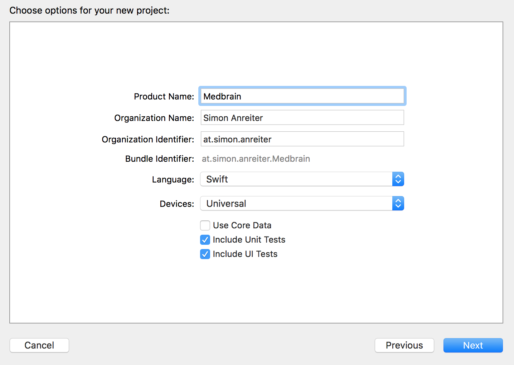

# Step 1 - Project Setup

## Prerequisites
- Installed XCode 7.3 (Current Version as of writing this)

## Getting Started
1. Create your __working directory__
for example run `mkdir medbrain` in the Terminal
2. Open XCode and create a new Project

3. In the following screen select `Single View Application`

This template will create an iOS-App with a single empty screen.

4. Enter a Product Name for the project (In this case `Medbrain`)

>__Note:__ the `Organization Identifier` and `Bundle Identifier` typically follow a reverse-DNS-format.
>The `Bundle Identifier` is used to uniquely identify your app (i.e.: in the iTunes AppStore)
>By Default this is set by the following Schema `${Organization Identifier}.${Product Name}` but can be set manually at a later point.

5. When prompted where to create the project select the previously created __working directory__.

## Conclusion
You completed the basic setup for an iOS-App

Next up is installing dependencies via CocoaPods

[Continue to Step 2 of the Tutorial](STEP2.md)
