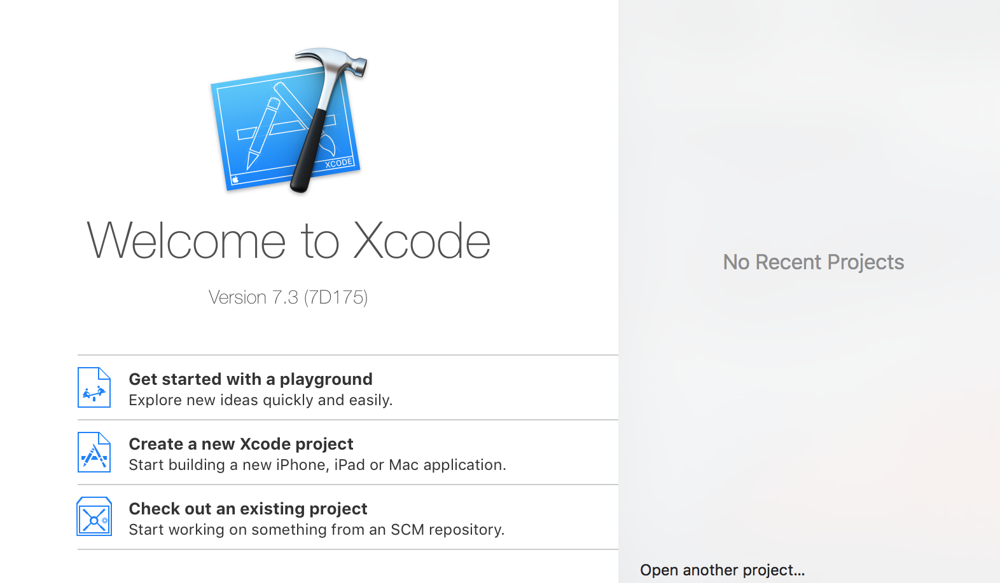
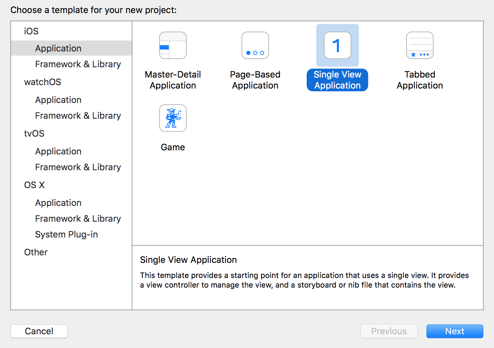

# Step 1 - Project Setup

## Prerequisites
- Installed XCode 7.3 (Current Version as of writing this)

## Getting Started
1. Create your __working directory__
for example run `mkdir medbrain` in the Terminal
2. Open XCode and create a new Project

3. In the following screen select `Single View Application`

This template will create an iOS-App witha single empty screen. 
