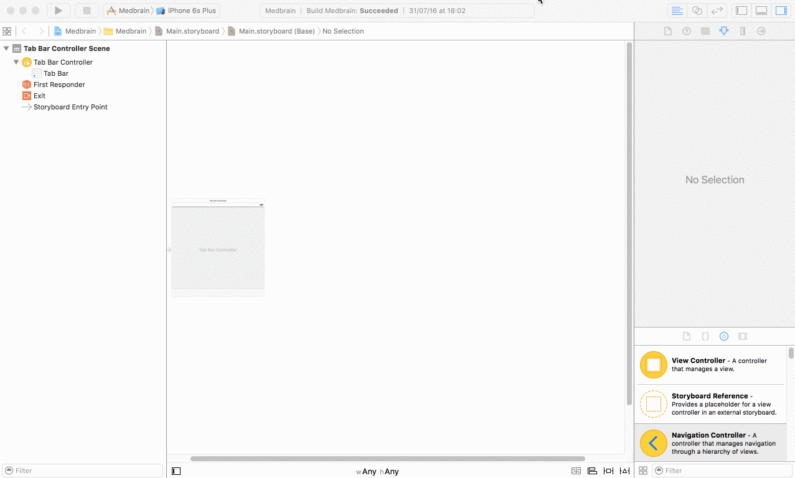
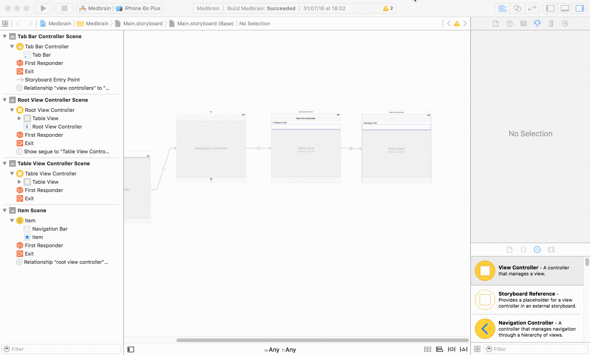
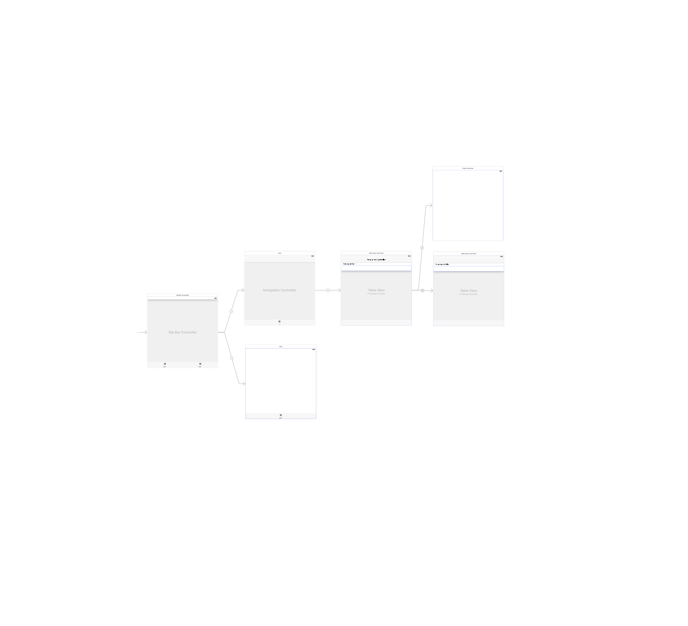

# Step 4 - Building the Application Structure

## Prerequisites
Finished [Step 2](STEP2.md) of this Tutorial.

If you want to start here you just run `git checkout step4`.

The Project is located at `project/` of the git repository root.

## Goals
In this step each of the apps screens will be added as a placeholder implementation.
Each screens functionality will be implemented later on.

Learn about building User Interfaces utilizing X-Codes Interface-Builder and Storyboards.

## Getting started
By default X-Code creates a storyboard name `Main.storyboard`.

It contains a single `ViewController`.

We start of by deleting the `ViewController` and its corresponding ViewController implementation.

1. Delete the file `ViewController.swift`
2. Select file `Main.storyboard` in the project navigator.
3. Select the empty `ViewController` and delete it.

#### Adding a TabBarController
1. From the Interface-Builders `object-library` drag a `Tab Bar Controller` object onto the storyboard.
2. Delete the to ChildControllers.
3. Select the newly added controller and in the `Attributes Inspector` select the checkbox `Is Initial ViewController`

#### Building the Navigation-flow
1. Select a `Navigation Controller` from the `object-library` and drag it onto the storyboard.
>__Note:__ This also adds an empty `Table View Controller`
>
> The added `Table View Controller` will later show a list of the patients medications and will be referred to as `PatientMedicationsViewController`.

2. Drag a `Table View Controller` from the object-library onto the storyboard.
>__Note:__ This controller will show a single medication in more detail and will be referred to as `MedicationDetailViewController`.

3. `ctrl+drag` from the first `PatientMedicationsViewController` to the newly added  `MedicationDetailViewController`
4. select `show` in the `Manual-Segue` section

5. `ctrl+drag` from the `Tab Bar Controller` to the `Navigation Controller`
6. select `viewcontrollers` in the `Relationship-Segue` section

#### Adding the SignInViewController
To be able to determine which medications to show the patient has to sign-in.

In order to sign-in a new `View Controller` named `PatientSignInViewController` will be introduced.

This controller will be shown every time the user reaches the `PatientMedicationsViewController` and is not signed-in.

1. From the `object-library` drag a `View Controller` object on to the storyboard.

2. `ctrl+drag` from the first `PatientMedicationsViewController` to the newly added
`PatientSignInViewController`.

3. select `Present Modally` in the `Manual-Segue` section.

#### Adding the PatientDetailViewController

After signing in the user should have the option to review his information (i.e.: email-address, phone-number, etc.)

This functionality will be implemented in the `PatientDetailViewController`.

1. From the `object-library` drag a `View Controller` object on to the storyboard.
2. `ctrl+drag` from the `Tab Bar Controller` to the `PatientDetailViewController`
3. select `viewcontrollers` in the `Relationship-Segue` section

When you are finished the end result should look similar to this:

## Conclusion
You setup a storyboard showing the apps intended flow.

Next-up is implementing the sign-in.

[Continue to Step 5 of the Tutorial](STEP5.md)
