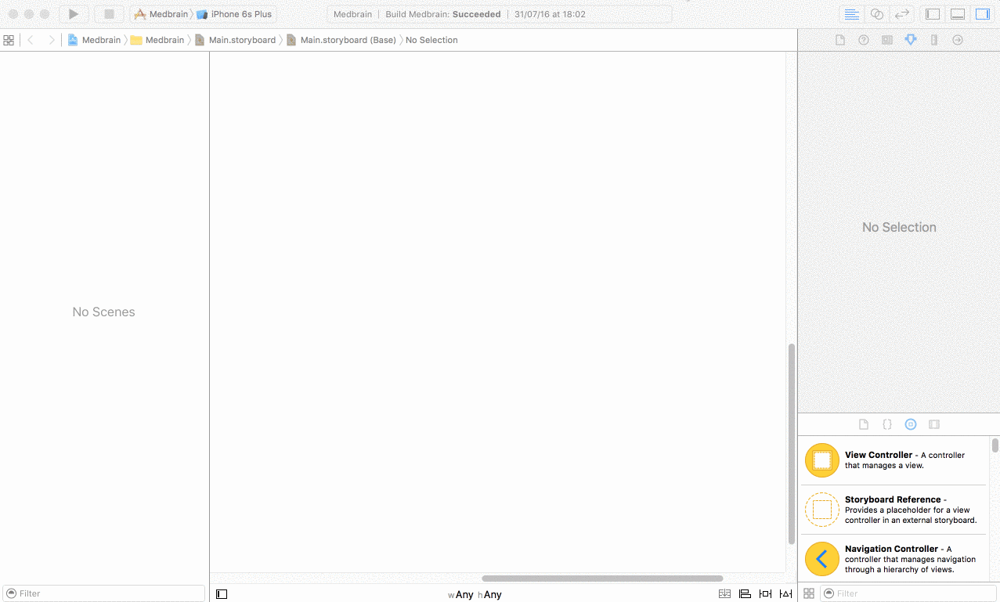

# Step 4 - Building the Application Flow

## Prerequisites
Finished [Step 2](STEP2.md) of this Tutorial.

If you want to start here you just run `git checkout step4`.

The Project is located `project/` of the git repository root.

## Goals
In this step the each of the apps screens will be added as a placeholder implementation.
Each screens functionality will be implemented later on.

Learn about building UserInterfaces utilizing X-Codes Interface-Builder and Storyboards.

## Getting started
By default X-Code creates a storyboard name `Main.storyboard`.

It contains a single `ViewController`.

We start of by deleting the `ViewController` and its corresponding ViewController implementation.

1. Delete the file `ViewController.swift`
- Select file `Main.storyboard` in the project navigator.
- Select the empty ViewController and delete it.

#### Adding the TabBarController
1. From the Interface-Builders Object library drag a `Tab Bar Controller` object onto the storyboard.

- Delete the to ChildControllers.
- Select the newly added controller and in the `Attributes Inspector` select the checkbox `Is Initial ViewController`

#### Building the Navigation-flow
- Select a `Navigation Controller`from the object-library and drag it onto the storyboard.
>__Note:__ this also adds a empty `Table View Controller`
>
> the added `Table View Controller` will later show a list of the patients medications and will be referred to as `PatientMedicationsViewController`

- Drag a `Table View Controller` from the object-library onto the storyboard.
>__Note:__ This controller will show a single medication in more detail and will be referred to as `MedicationDetailViewController`

- `ctrl` +  drag from the first `PatientMedicationsViewController` to the newly added  `MedicationDetailViewController`
- select `show` in the `Manual-Segue` section

- `ctrl` + drag from the `Tab Bar Controller` to the `Navigation Controller`
- select `viewcontrollers` in the `Relationship-Segue` section

#### Adding the SignInViewController
To be able to determine which medications to show the patient has to sign-in.

In order to sign-in a new viewcontroller named `PatientSignInViewController` will be introduced.

This controller will be shown every time the user reaches the `PatientMedicationsViewController` and is not signed-in.

1. From the object-library drag a `View Controller` object on to the storyboard.

- `ctrl` +  drag from the first `PatientMedicationsViewController` to the newly added
`PatientSignInViewController`.

- select `present modally` in the `Manual-Segue` section.

#### Adding the PatientDetailViewController

After signing in the user should have the optionto review his information (i.e.: email-adress, phone-number, etc.)

This functionality will be implemented in the `PatientDetailViewController`.

1. From the object-library drag a `View Controller` object on to the storyboard.
- `ctrl` + drag from the `Tab Bar Controller` to the `PatientDetailViewController`
- select `viewcontrollers` in the `Relationship-Segue` section

#### Creating the ViewController classes
The viewcontrollers which where added to the storyboard are empty t

Create a view which shows a list of all patients prescriptions.

A prescription is modelled in FHIR as [MedicationOrder](https://www.hl7.org/fhir/medicationorder.html).

Each list-item corresponds to one prescription.
The information in each list-item is very limited, upon clicking a item a detail-view
showing more detailed information is shown (this will be implemented in the next step).

so the first priority is to sign-in.

For the implementation we will introduce following classes:

- SessionManager
- SignInViewController
- PatientDetailViewController

##### SessionManager
- Implemented as a singleton.
- Its responsibility is to manage the currently signed in patient.
- handle log-out

##### SignInViewController
-

in addition a new dependency will be introduced.

A prescription is modelled in FHIR as [MedicationOrder](https://www.hl7.org/fhir/medicationorder.html).

Each list-item corresponds to one prescription.
The information in each list-item is very limited, upon clicking a item a detail-view
showing more detailed information is shown (this will be implemented in the next step).

## Assumptions
- each `Medication` has a display-name: at keypath: `$(medication).code.coding.display`
