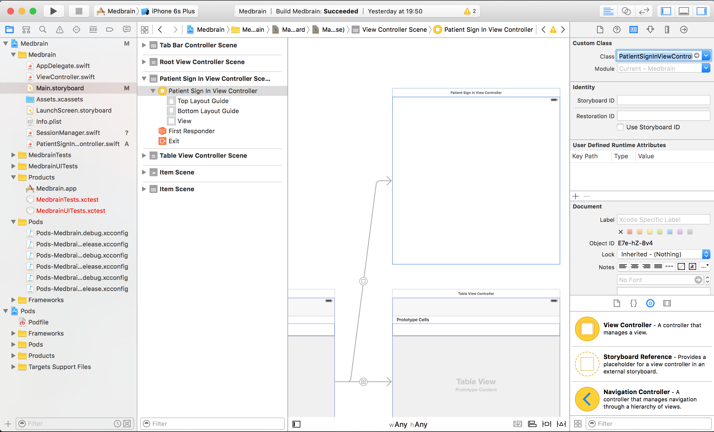
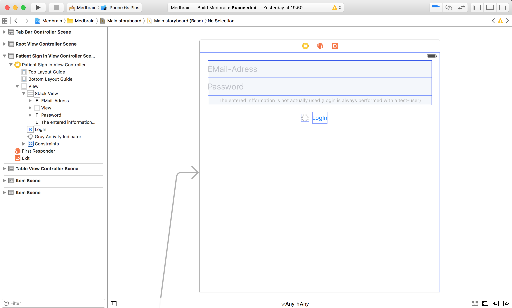
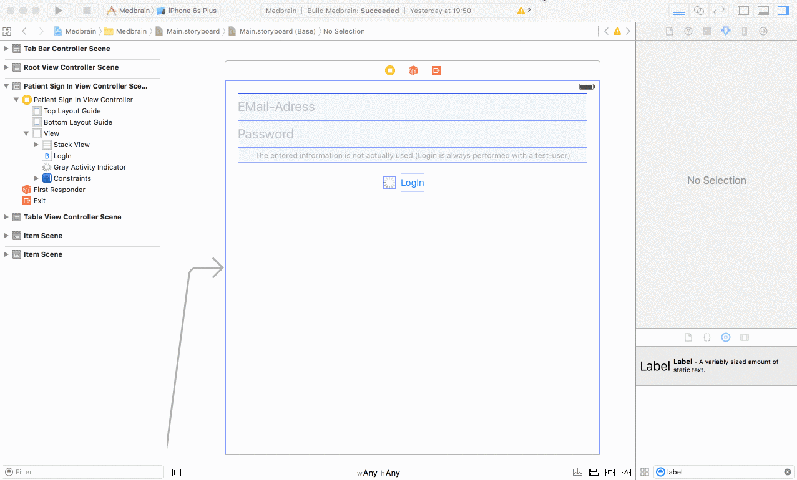

### Implementing SignIn - PatientSignInViewController Interface

1. create a new file named `PatientSignInViewController.swift` (`File->New->File`)
  - When prompted for a template for the file choose `iOS->Cocoa Touch Class`
  - in the next step choose `PatientSignInViewController`
  - make it a subclass of `UIViewController`

2. in the `Main.storyboard` we created the `PatientSignInViewController` but it is not linked to its implementation.
  - go to the `Main.storyboard` and select the `PatientSignInViewController`
  - in the `Identity-Inspector` under the `Custom-Class` enter `PatientSignInViewController`




### Building the Interface

>__Note:__ In this tutorial the design will not be handled.
Instead the required UI-elements will be defined and shown how they need to be linked.


The `PatientSignInViewController` requires the following elements:
- TextField for entering e-mail
- TextField for entering password
- Button for submitting the entered information
- Activity indicator being displayed while the log-in is in process

for this purpose we have to define `outlets` in the class-implementation.
>__Note:__ Outlets are a way of connecting elements in the Interface-Builder to the implementation.
The creation and configuration could also be done programmatically.

##### 1. add the outlets to the class
add the following to the `PatientSignInViewController` implementation
```swift
@IBOutlet var emailTextfield: UITextField!
@IBOutlet var passwordTextfield: UITextField!
@IBOutlet var submitButton: UIButton!
@IBOutlet var activityIndicator: UIActivityIndicatorView!

@IBAction func submitButtonPressed(sender: AnyObject?) {
    //will be implemented later
}
```

##### 2. In the storyboard add the elements.
The end result can look like this:


##### 3. Connect the storyboard-elements to the outlets and actions.


[Continue with Step 5.2 of the Tutorial](STEP5-2.md)
