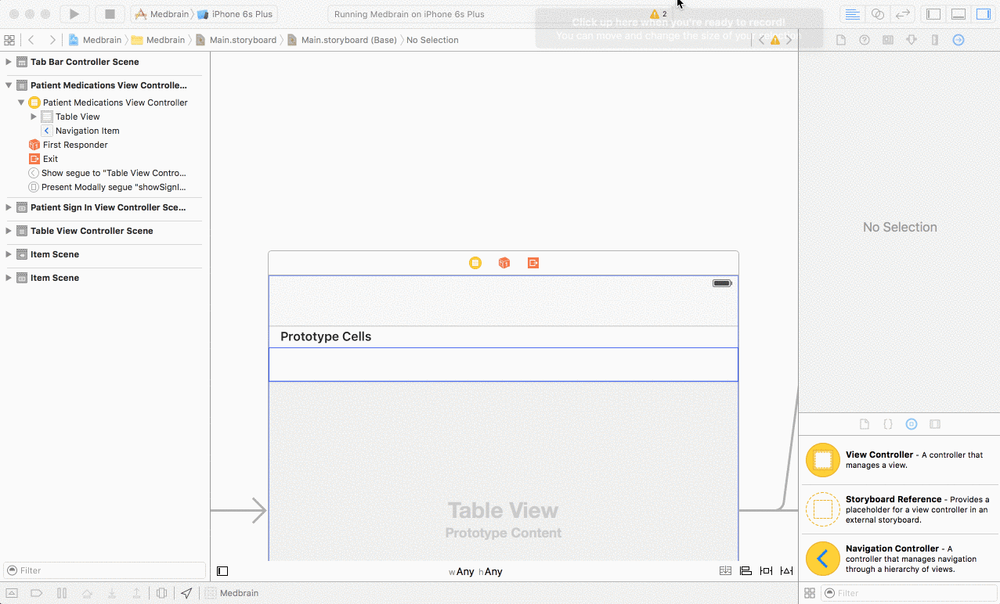
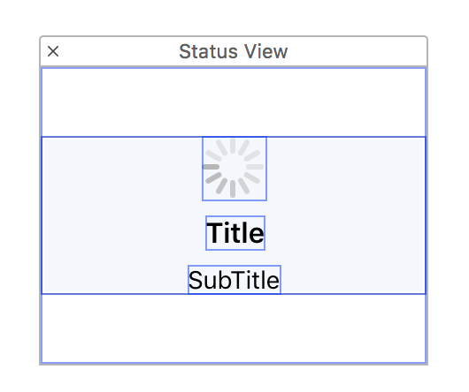
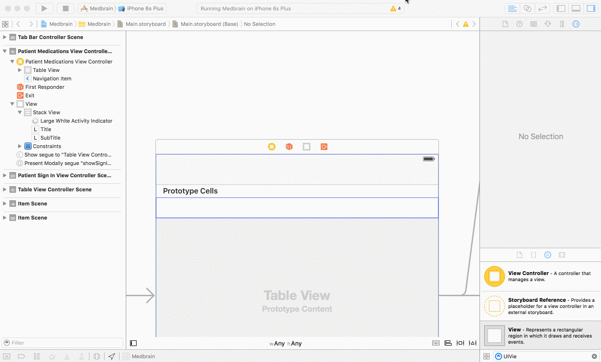

# Step 6.1 Implementing PatientMedicationsViewController - PatientMedicationsViewController Interface


Similar to creating  the `PatientSignInViewController` interface:
- Create a `UITableViewController` subclass named `PatientMedicationsViewController`
- In the `Main.storyboard` select the `PatientMedicationsViewController` and set its class to `PatientMedicationsViewController`

#### Creating the StatusView
This ViewController loads data from a remote source.
While performing such a task its common practice to do this asynchronously. (While performing this task the user can still interact with the app.)

To inform the user that the app is fetching data it displays a StatusView.

This StatusView has responsibility for displaying:
- loading states
- error states
- empty states


##### Define the outlets in the implementation.
The StatusView consists of two elements:
- loading-indicator
- title-label

for these and the StatusView itself outlets are declared.

Add the following to the `PatientMedicationsViewController`

```swift
@IBOutlet var statusView: UIView!
@IBOutlet weak var activityIndicator: UIActivityIndicatorView!
@IBOutlet weak var statusTitleLabel: UILabel!
```

drag a view object from the object-library onto the `PatientMedicationsViewController`



Again the implementation of the design will not be explained in depth.
The important part is that all elements are added.

The end-result can look like this:



Connect the storyboard-elements to the outlets.



To actually show the statusView it has to be set to be the tableViews backgroundView.

To do so the `viewDidLoad` is overridden.
This method gets called after the view is created.
At this point all storyboard-elements have been linked up.

```swift
override func viewDidLoad() {
    super.viewDidLoad()

    tableView.backgroundView = statusView
}
```
To keep track of the state a `State` enum is and an corresponding property introduced:
```swift
enum State {
    //Starting state show nothing
    case Initial

    //Fetching medications from the server
    case LoadingResults

    //Fetching medications failed
    case Error

    //Fetching medications succeeded but list was empty
    case Empty

    //Fetching medications succeeded
    case Loaded
}

var state: State = .Initial
```

Additionally thre convenience accessors are added to the `State` enum

```swift
///does the statusView need to be shown
var showsStatusView: Bool {
    switch self {
    case .Initial, .LoadingResults, .Error, .Empty:
        return true
    case .Loaded:
        return false
    }
}

///when the statusView is show should the loading-indicator be displayed
var showsLoadingIndicator: Bool {
    switch self {
    case .LoadingResults:
        return true
    case .Initial, .Error, .Empty, .Loaded:
        return false
    }
}

///The text displayed in the statusView
var title: String? {
    switch self {
    case .Initial:
        return nil
    case .LoadingResults:
        return "Loading..."
    case .Error:
        return "Error"
    case .Empty:
        return "No Prescriptions"
    case .Loaded:
        return nil
    }
}
```


the ViewController has to be able to display every state.
For this purpose an new method is added.

```swift
func configure(forState state: State) {
    //Hide/show the statusView
    statusView.hidden = !state.showsStatusView

    //Hide show the titleLable
    statusTitleLabel.hidden = state.title?.isEmpty ?? true
    statusTitleLabel.text = state.title ?? " "


    //Start/Stop Animating the activityIndicator
    if activityIndicator.isAnimating() && !state.showsLoadingIndicator {
        activityIndicator.stopAnimating()
    } else if !activityIndicator.isAnimating() && state.showsLoadingIndicator {
        activityIndicator.startAnimating()
    }
}
```
This method should be called every time the controllers `state` changes.

This can be achieved by adding a `property observer` to the state property.
```swift
var state: State = .Initial {
    didSet {
        configure(forState: state)
    }
}
```

Additionally to initially configure the statusView the following should be modified as follows:

```swift
override func viewDidLoad() {
    super.viewDidLoad()

    tableView.backgroundView = statusView

    //configure the statusView for the current state
    configure(forState: state)
}
```

[Continue with Step 6.2 of the Tutorial](STEP6-2.md)
