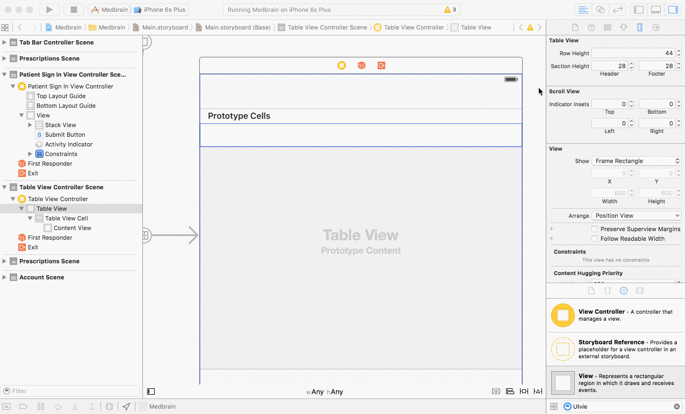
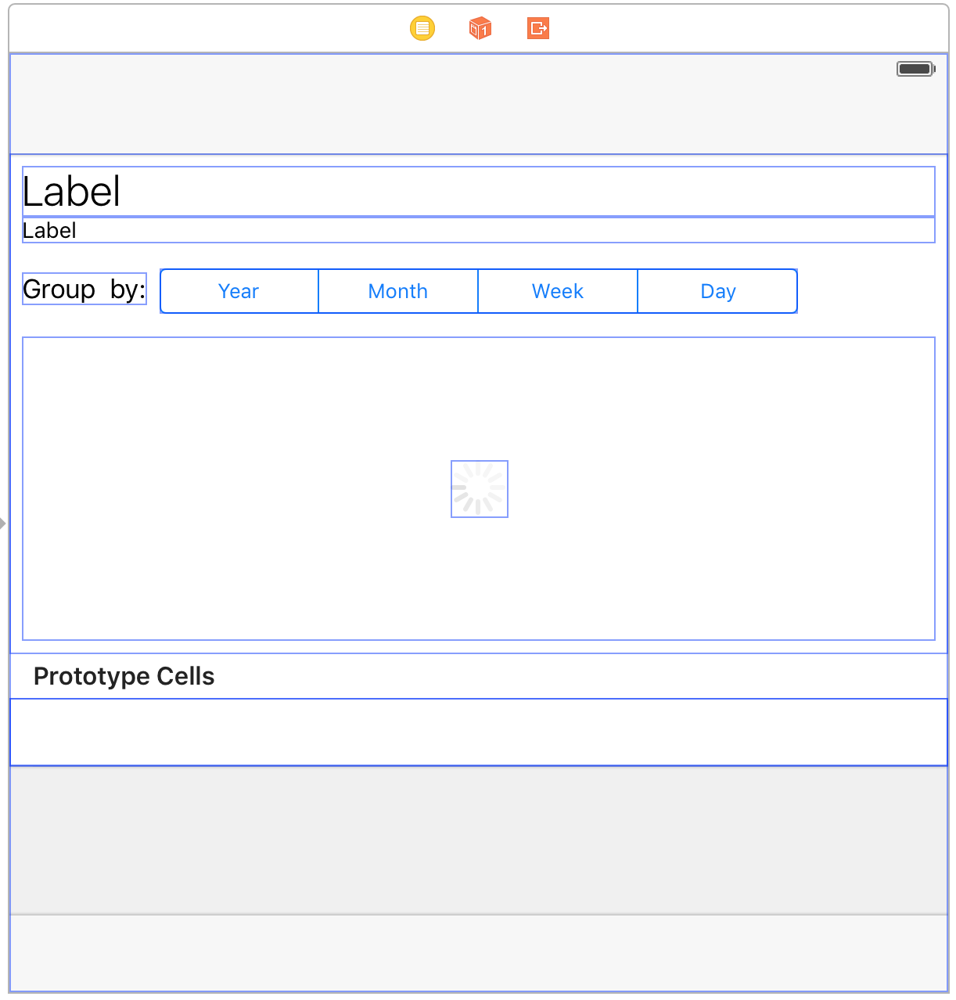

# Step 7.1 - Implementing `MedicationDetailViewController` - MedicationDetailViewController Interface

### Create the implementation class

Create a new `UITableViewController` subclass named `MedicationDetailViewController`

In the `Main.storyboard` change the `MedicationDetailViewController` class to `MedicationDetailViewController`

### Adding the HeaderView

Add a tableHeaderView to the table view by dragging a view object from the object library to the top edge of the tableView.



This headerView will contain:
- __TitleLabel__ displaying the name of the medication.
- __SubtitleLabel__ displaying the instructions for the medicationOrder
- a GraphView displaying a timeline of the administrations
- a __SegmentedControl__ allowing to customize the grouping of administrations (by year, month, week or day)
- a __ActivityIndicator__ indicating progress while the administrations are loaded from the server


### Defining the outlets and actions

First import `ResearchKit`

```swift
@IBOutlet var titleLabel: UILabel!
@IBOutlet var subtitleLabel: UILabel!
@IBOutlet var segmentedControl: UISegmentedControl!
@IBOutlet var activityIndicator: UIActivityIndicatorView!
@IBOutlet var chartView: ORKLineGraphChartView!

@IBAction func segmentedControlChanged(sender: AnyObject?) {

}

```

Again the design will not be explained in depth.
Add the according elements and connect the outlets.
for the segmentedControl add the `segmentedControlChanged` action for the control-event `ValueChanged`

To add the chartView:
- drag a `View` object from the `object library`.
- select the view and in the `Identity Inspector` set its class to `ORKLineGraphChartView`


The end-result can look like this:




### Create the MedicationAdministrationTableViewCell

Create a new `UITableViewCell` subclass named `MedicationAdministrationTableViewCell`

Like before select the tableView-cell in the storyboard

Set its class to `MedicationAdministrationTableViewCell` in the `Identity Inspector`

Set its identifier to `MedicationAdministrationTableViewCell` in the `Attributes Inspector`

Set its style to `Subtitle` in the `Attributes Inspector`


[Continue with Step 7.2 of the Tutorial](STEP7-2.md)
