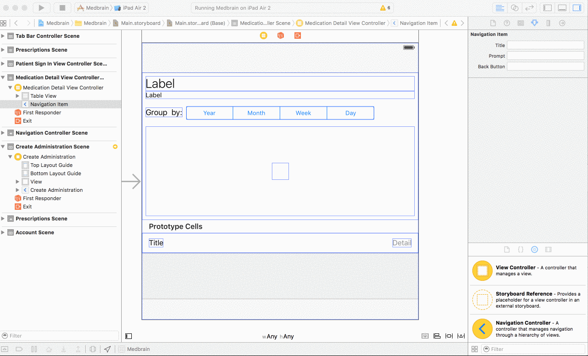
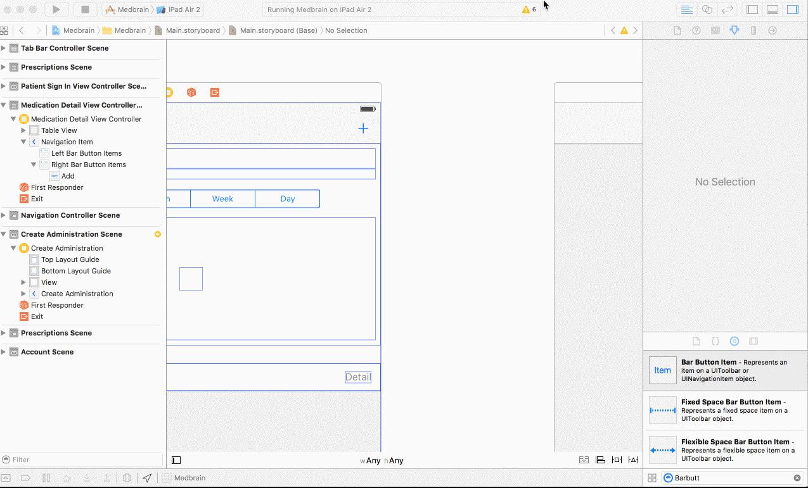
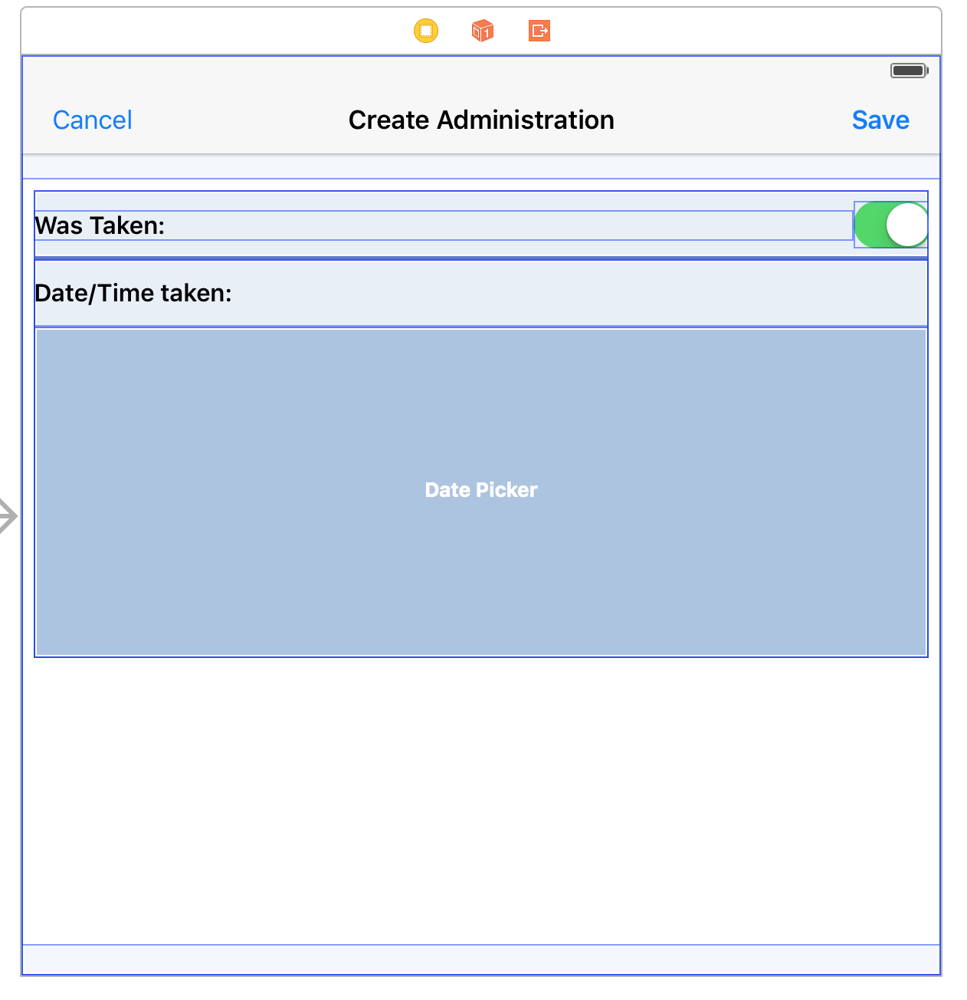

# Step 8.1 - Implementing CreateMedicationAdministrationViewController - Building the Interface

The `CreateMedicationAdministrationViewController` displays a fairly simple interface:

The UI-Elements needed are:
- __Switch__ allowing the user to specify wether the medication was administered or not administered.
- __DatePicker__ allowing the user to specify when the medication was administered/not administered.
- __CancelButton__ allowing the user to cancel the creation of the administration.
- __SaveButton__ allowing the user to finally "save" (create the resource on the server) the `MedicationAdministration`

The `CreateMedicationAdministrationViewController` is only reachable from the `MedicationDetailViewController`.

It creates a `MedicationAdministration` for the `medicationOrder` shown in the `MedicationDetailViewController`

#### Defining the outlets and actions

1. Create a `UITableViewController` subclass named `CreateMedicationAdministrationViewController`.
2. In it import the `SMART` framework by adding `import SMART`
3. Add the following outlets and actions:
```swift
@IBOutlet weak var switchControl: UISwitch!
@IBOutlet weak var datePicker: UIDatePicker!
@IBOutlet var saveBarButtonItem: UIBarButtonItem!
@IBOutlet var cancelBarButtonItem: UIBarButtonItem!

@IBAction func cancelPressed(sender: AnyObject?) {
  //will be implemented later
}

@IBAction func saveAdministration(sender: AnyObject?) {
  //will be implemented later
}
```

#### Setting up the ViewController

1. In the `Main.storyboard` drag a new `View Controller` object on to the storyboard.
2. Select it and change its class to `CreateMedicationAdministrationViewController`
3. under `Editor->Embed In` select `Navigation Controller`
4. Select the `MedicationDetailViewController` and add a `BarButtonItem`

5. Select the `BarButtonItem` and in the `Attributes Inspector` for `System Item` set its value to `Add`
6. `ctr+drag` from the `BarButtonItem` to the `Navigation Controller`
 in which the `CreateMedicationAdministrationViewController` is embedded.
 
7. In the `Action Segue` Segue Section select `Present Modally`.
8. Select the `Segue` and in the `Attributes Inspector` assign it the identifier `createAdministration`

#### Creating the interface
1. Add a `BarButtonItem` to the right side of the `CreateMedicationAdministrationViewController` and set its `System Item` value to `Save`
2. Connect the `BarButtonItem` to the `saveBarButtonItem` outlet.
3. Connect the `BarButtonItem` to the `func saveAdministration(sender: AnyObject?)` action.
4. Add a `BarButtonItem` to the left side of the `CreateMedicationAdministrationViewController` and set its `System Item` value to `Cancel`
5. Connect the `BarButtonItem` to the `cancelBarButtonItem` outlet.
6. Connect the `BarButtonItem` to the `func cancelPressed(sender: AnyObject?)` action.

The rest of the design is not handled in depth. At least add a `Switch` and a `DatePicker` object and connect them to the corresponding outlets.

The end-result can look like this.

