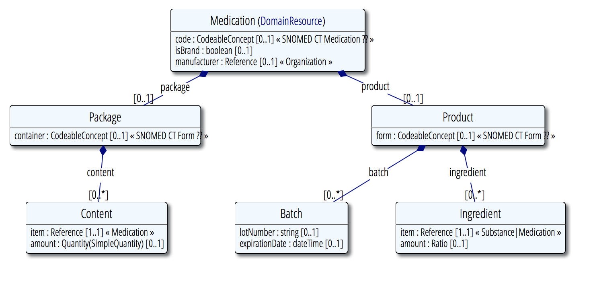

## Medication
https://www.hl7.org/fhir/medication.html

Represents a medication.


>__Note:__ In the context of the app only the medications name is displayed, therefore its only requirement is its name.

>this should not imply it describes a medication sufficiently.


### UML



##### Requirements

 requirement      | expression                    | required
------------------|-------------------------------|-------------
has display-name  | `medication.code.coding[0].display != null`      | yes

##### Example-Resources
- [Ciproxin.xml](examples/Ciproxin.xml)
- [Coldistop.xml](examples/Coldistop.xml)
- [Nasivin.xml](examples/Nasivin.xml)
- [Novalgin.xml](examples/Novalgin.xml)

##### Referenced by
```
CarePlan, Group, MedicationAdministration, MedicationDispense, MedicationOrder, MedicationStatement, Procedure, SupplyDelivery, SupplyRequest
```
