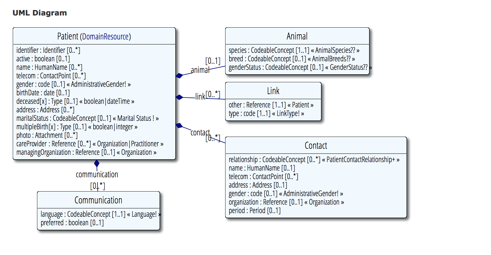

## Patient
https://www.hl7.org/fhir/patient.html

The patient-resource has a central role in this app.
It contains basic information about the person.

>__Note:__ a patient in FHIR is not necessarily human.
>but in the context of the app it is assumed that the patient is human.


### UML



##### Requirements

 requirement      | expression                    | required
------------------|-------------------------------|-------------
is human          | `patient.animal == null`      | yes
has family name   | `patient.name.family != null` | yes
has first name    | `patient.name.given != null`  | no
has phone-number  | `patient.telecom[0] != null`  | no

##### Examples
- [Patient.xml](examples/Patient.xml)

##### Referenced by
```
Account, AllergyIntolerance, Appointment, AppointmentResponse, AuditEvent, Basic, BodySite, CarePlan, Claim, ClinicalImpression, Communication, CommunicationRequest, Composition, Condition, Contract, Coverage, DetectedIssue, Device, DeviceUseRequest, DeviceUseStatement, DiagnosticOrder, DiagnosticReport, DocumentManifest, DocumentReference, Encounter, EnrollmentRequest, EpisodeOfCare, FamilyMemberHistory, Flag, Goal, Group, ImagingObjectSelection, ImagingStudy, Immunization, ImmunizationRecommendation, List, Media, MedicationAdministration, MedicationDispense, MedicationOrder, MedicationStatement, NutritionOrder, Observation, Order, Person, Procedure, ProcedureRequest, Provenance, QuestionnaireResponse, ReferralRequest, RelatedPerson, RiskAssessment, Schedule, Specimen, SupplyDelivery, SupplyRequest, VisionPrescription
```
